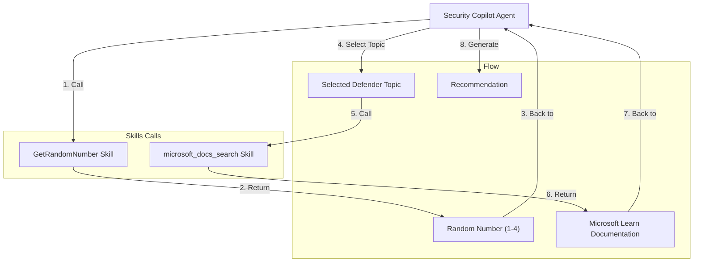

# Daily suggestion

This project showcases a simple custom Security Copilot agent designed to provide recommendations on Microsoft Security products. It is intended for demonstration and educational purposes only — not for production use.

  

## How It Works

The agent performs two main tasks:

1. **Topic Selection**  
   It randomly selects one of the following Microsoft Defender products:
   - Defender for Endpoint
   - Defender for Cloud Apps
   - Defender for Identity
   - Defender for Office 365

2. **Documentation Search**  
   Once a topic is selected, the agent searches Microsoft Learn for relevant documentation and guidance.

## Skills Used

The agent leverages two custom skills:

| Skill Name              | Purpose                                                             |
|-------------------------|---------------------------------------------------------------------|
| `GetRandomNumber`       | Generates a random number to select a Defender topic               |
| `microsoft_docs_search` | Searches Microsoft Learn for product-specific documentation        |

These skills are implemented as separate plugins:
- `RandomNumber` [link](https://github.com/mariocuomo/Experimenting-With-Security-Copilot/tree/main/custom%20plugins/RandomNumber)
- `MSLearnDocumentationMCPServer` [link](https://github.com/mariocuomo/Experimenting-With-Security-Copilot/blob/main/skilling%20series/Day%205%20-%20MCP/NoAuth_MCP/MSLearn_MCP.yaml)

## Why Use a Random Number Plugin?

Generative AI models are not designed to produce truly random numbers. To ensure randomness, this agent uses the [Random Number API](https://www.randomnumberapi.com/api/v1.0/random?min=1&max=4&count=1) to generate a number between 1 and 4, which corresponds to one of the Defender products.

## Project Goals

- Demonstrate how to configure and integrate custom skills into a Security Copilot agent
- Provide a hands-on example of using external APIs and Microsoft Learn search capabilities
- Serve as a starting point for building more advanced security-focused agents

