# Sentinel Security Copilot Assistant

version: _1.0_

Sections in this page
- [What is](#WHAT)  
- [Schema](#SCHEMA)  
- [Deploy](#DEPLOY)  
- [Considerations](#CONSIDERATIONS)  

# What is

**Sentinel Security Copilot Assistant (SSCA)** is a collection of robust playbooks designed to seamlessly integrate Microsoft Security Copilot with Microsoft Sentinel. By leveraging the power of AI-driven insights and automation, SSCA enhances security operations by enabling capabilities such as entity enrichment, incident summarization, and more.

**📌 Key Features**
- **Entity Lookup**: Quickly retrieve and enrich information about IPs, domains, users, and devices, streamlining investigation workflows.
- **Incident Summary**: Generate both brief and expanded summaries of incidents, providing clear and actionable insights for security teams.
- **Scheduled Updates**: Deliver regular updates on incident situations, Microsoft Sentinel's health, and SOC efficiency metrics, keeping your team informed and proactive.

**🛠 Prerequisites**  
Before you begin, ensure you have:
- A valid **Microsoft Sentinel** instance.
- Access to **Microsoft Security Copilot**.
- Necessary permissions to configure and run Sentinel playbooks.

# Schema

The SSCA solution deploys several Azure Logic Apps, categorized by their intended functionality.  
Below is a description of each resource.  

### Entity Lookup  
These Logic Apps are designed to enrich security investigations by providing detailed information about specific entities and posted them as Sentinel incident Comment.
- **SSCA-IPLookupComment**  
Enriches incident investigations with contextual information about IP addresses (e.g., geolocation, threat intelligence).
- **SSCA-DomainLookupComment**  
Retrieves data about domains, such as reputation, WHOIS details, and DNS information.
- **SSCA-UserLookupComment**  
Provides insights into user activities and account-related data for faster security triage.
- **SSCA-DeviceLookupComment**  
Supplies detailed device-related information, including device compliance, vulnerabilities, and configuration.

### Incident Summary
These Logic Apps generate concise and comprehensive summaries for security incidents to improve situational awareness and post the summary as Sentinel incident comment.
- **SSCA-IncidentSummary-Brief**  
Creates a quick, high-level summary of incidents for immediate insights and faster decision-making.
- **SSCA-IncidentSummary-Expanded**  
Produces a detailed, in-depth summary of incidents, including key findings and recommendations.

### Scheduled Updates
These Logic Apps deliver periodic reports and summaries to keep security teams informed about various operational metrics via email.
- **SSCA-IncidentsSituationEmail**  
Sends a scheduled overview of the current incident situation, highlighting trends and unresolved cases.
- **SSCA-SentinelHealthEmail**  
Provides updates on the health status of Microsoft Sentinel to ensure continued optimal performance.
- **SSCA-SOCOptimizationEmail**  
Reports on SOC efficiency metrics, offering insights into workflow optimization and performance improvements.

```mermaid
graph TD
    style A fill:#f9f,stroke:#333,stroke-width:2px
    style B fill:#bbf,stroke:#333,stroke-width:2px
    style C fill:#bff,stroke:#333,stroke-width:2px
    style D fill:#fbf,stroke:#333,stroke-width:2px
    style E fill:#fdd,stroke:#333,stroke-width:2px
    style F fill:#fdd,stroke:#333,stroke-width:2px
    style G fill:#fdd,stroke:#333,stroke-width:2px
    style H fill:#fdd,stroke:#333,stroke-width:2px
    style I fill:#dfd,stroke:#333,stroke-width:2px
    style J fill:#dfd,stroke:#333,stroke-width:2px
    style K fill:#ddf,stroke:#333,stroke-width:2px
    style L fill:#ddf,stroke:#333,stroke-width:2px
    style M fill:#ddf,stroke:#333,stroke-width:2px

    A[SSCA Solution] 
    B[Entity Lookup] --> E[SSCA-IPLookupComment]
    B --> F[SSCA-DomainLookupComment]
    B --> G[SSCA-UserLookupComment]
    B --> H[SSCA-DeviceLookupComment]

    C[Incident Summary] --> I[SSCA-IncidentSummary-Brief]
    C --> J[SSCA-IncidentSummary-Expanded]

    D[Scheduled Updates] --> K[SSCA-IncidentsSituationEmail]
    D --> L[SSCA-SentinelHealthEmail]
    D --> M[SSCA-SOCOptimizationEmail]

    A --> B
    A --> C
    A --> D

```

# Deploy

# Considerations

> [!IMPORTANT]  
> Under Construction 🧰
