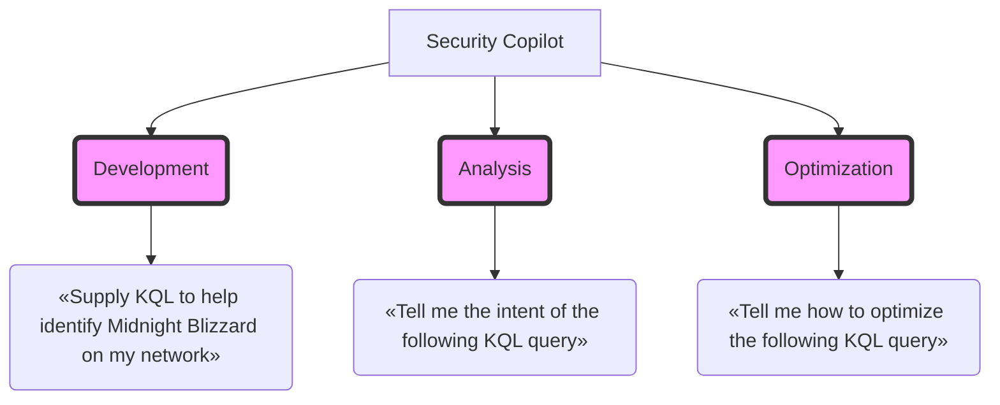

# KQL queries via Natural Language 
Generative AI and Security Copilot can help tremendously in **developing**, **analyzing**, and **optimizing** KQL queries.

### Devlopment
Security Copilot offers the **Natural language to KQL for Microsoft Defender XDR** and **Natural language to KQL for Microsoft Sentinel** plugins to generate KQL queries from natural language.  

### Analysis
Secuirty Copilot can be used to understand the intent of a KQL query, which will be explained line-by-line.  

### Optimization
Secuirty Copilot can be used to optimize a KQL query to be executed efficiently.  

